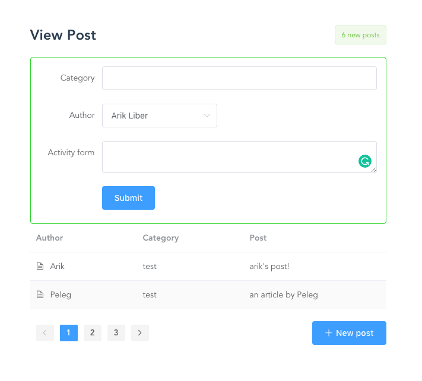

## Backend

> Tested with Python 3.6

Start dev server:
1. Run `source activate py36` if you are using virtual env, where py36 is an env with Python 3.6
2. Run DB migrations: `python manage.py migrate`
3. Start dev server: `python manage.py runserver`

Everytime a models is changed - run `python manage.py migrate ` and `python manage.py makemigrations polls`

### Mistakes

Software development has three main aspects: features, delivery time, quallity

Usually we must choose 2 out of the 3 to focus on.

In this project I decided to focus on delivery time and features thus quallity is greatly compremised.
How much? here is a list of known mistakes:

1. .gitignore is not optimal
2. no validation in endpoints
3. endpoints are not limited to specific HTTP verbs (i.e. GET, POST, etc.)
4. posts endpoint returns all post so pagination must be done in clientside
5. using sqlite - shuld use MySQL/Postgres
6. posts endpoint return auatrho id and not the name so lookup must be done in client side
7. latest articles enpoint is static
8. no test
9. no API endpoints documentation
10. folder structure is not optimal

## Client side

> Tested with Node 10.x

Start dev server:
1. Make sure backend is runnin (above)
2. Run `npm run serve`

### Mistakes
1. No Vuex
2. No Vue router
3. ESLint is not strict enough
4. Pagination is entirely local